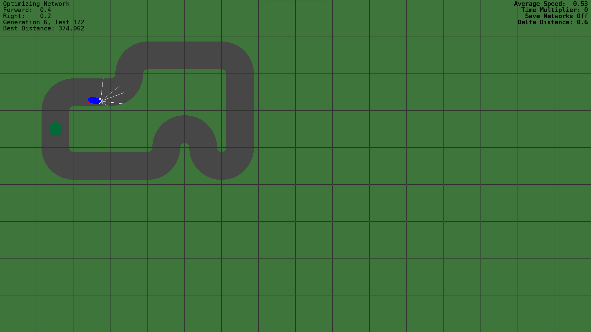
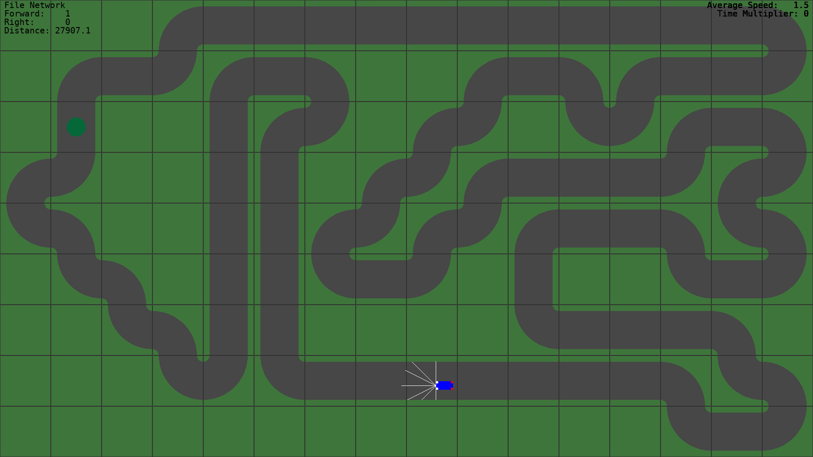

# Simple Neural Network

This is a simple optimising neural network to teach a car how to drive around a simple course.

## Images

## Methodology

The car has five sensors that give it distances from the walls of the course.

The neural network output is a scalar number indicating the direction and magnitude of the steering wheel, between -1 and 1, and a similar scalar for the direction and magnitude of the acceleration, from -1 to 1, for forward and backward movement.

The nural network uses a simple genetic algorithm to optimize a generation of networks and step forward over time to improve the quality of the results through reinforcement learning.

## Controls

Several controls are available to the user.

* `Escape` closes the game
* `Up` increases the speed of the simulation
* `Down` decreases the speed of the simulation
* `1` chooses the optimization mode
* `2` chooses the mode to show the best network so far
* `3` chooses the mode to show the network as saved in the `default.txt` file
* `Home` Resets the car to it's original position if using the best network so far or the file view
* `S` toggles whether to save the best networks. If enabled, the next network (and subsequent networks) that exceed the current best objective score will be saved to an output file
* `N` increments to the next map
* `P` pauses or un-pauses the simulation
* `F` switches between fullscreen mode and windowed mode.

## Fonts

Fonts and their associated licenses may be found in the `font` directory.
